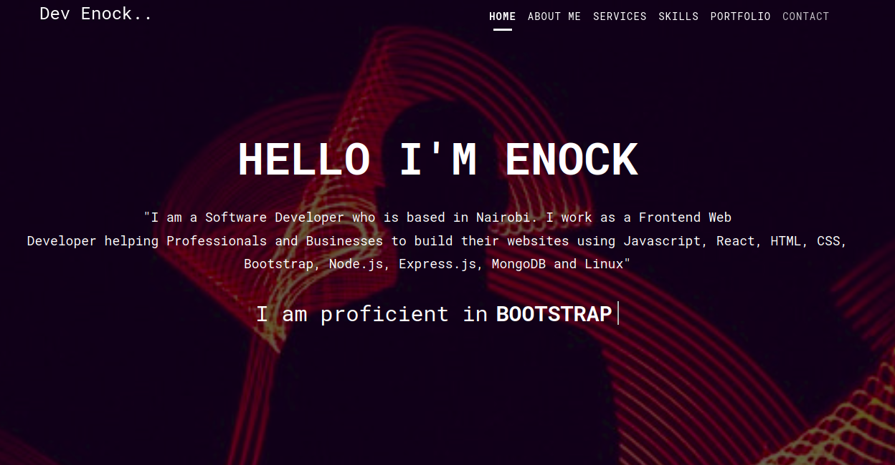

# Official Portfolio website.
**Site URL**: https://enock.tech/

## Technologies used:
**HTML**

**CSS**

**JAVASCRIPT**

## Goal of this project
   Build an online presence while practising diffrent technologies.

### How to run the project.
  
  Open your terminal in Linux or CMD in Windows and run: *git clone https://github.com/Trend20/mywebsite.git*

  Then right click the **index.html** file in your favorite browser to have a glimpse on the website. 

## N/B: This project is opensource and anyone can conrtibute to it.